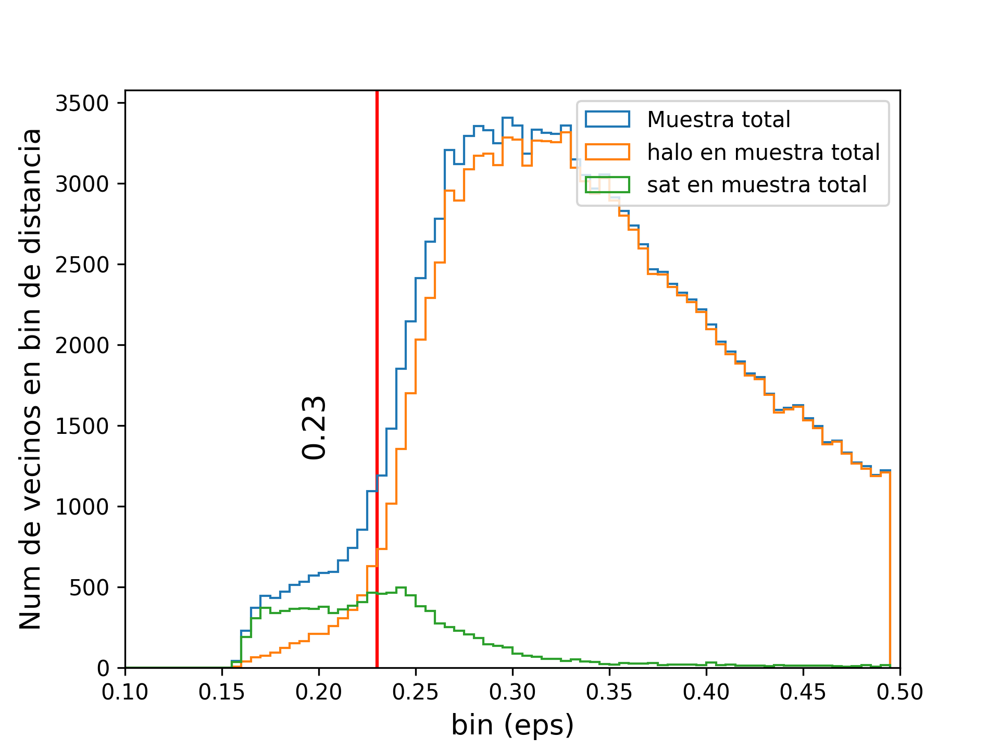
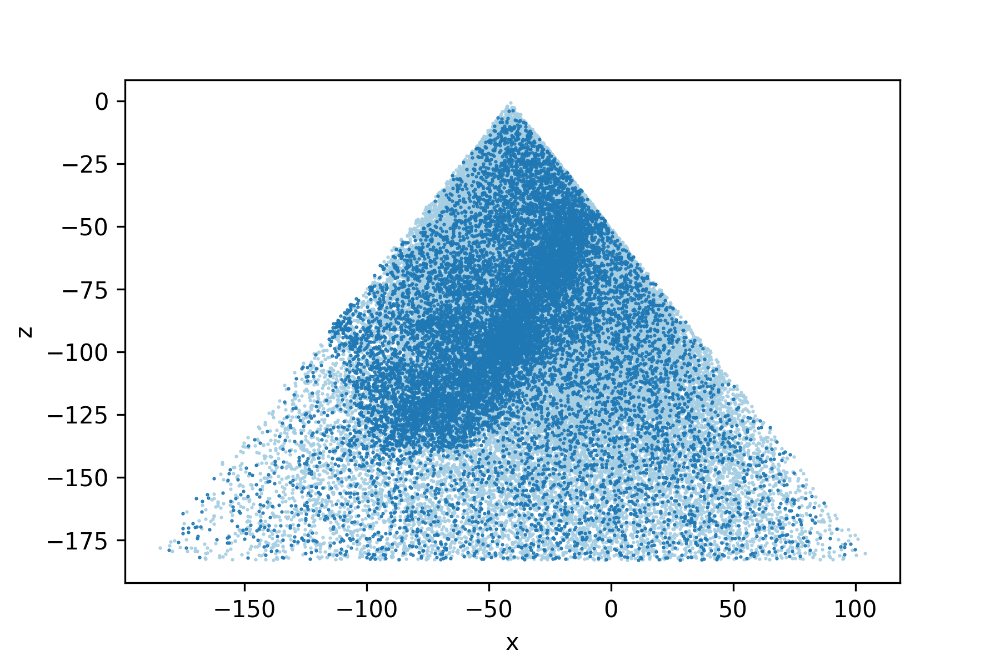
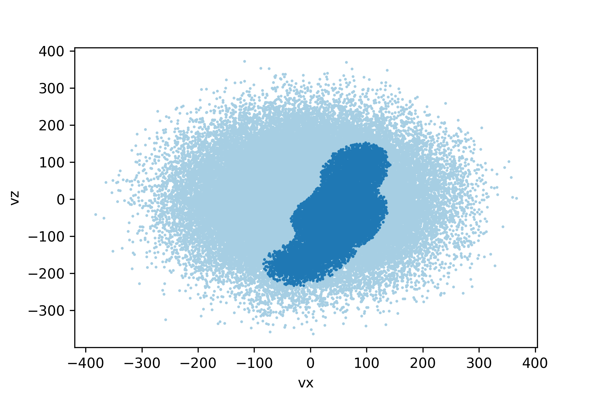
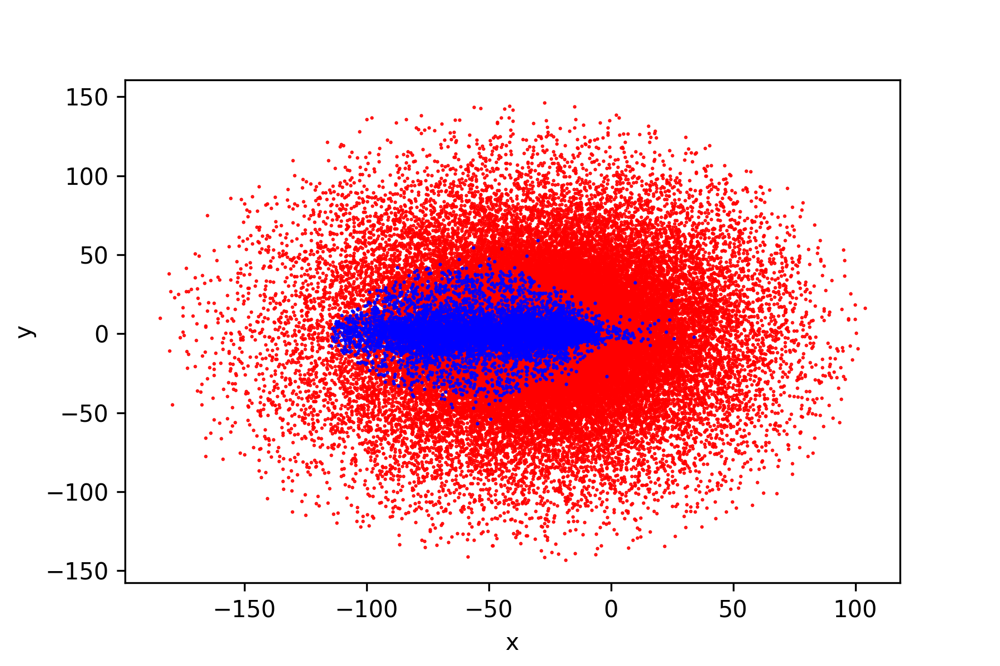
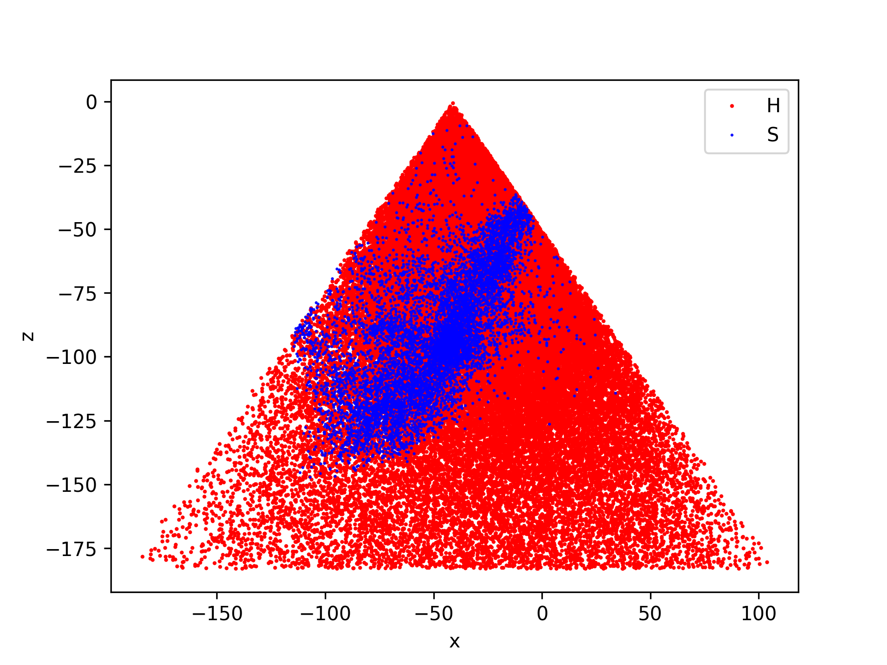
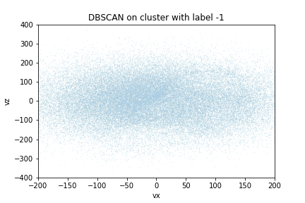
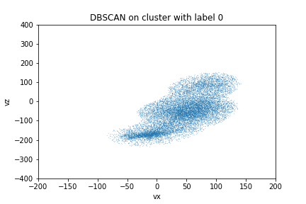
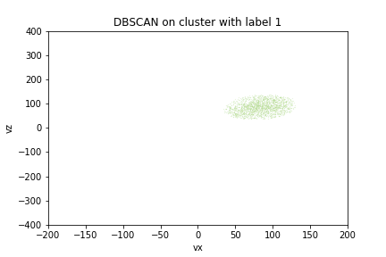

# DBSCAN Mocks – Cone Experiments

This repository contains practical experiments using the **DBSCAN** clustering algorithm,
applied to synthetic cone-like particle distributions.

The focus is on:
- Density-based clustering
- Noise detection
- Parameter sensitivity (`eps`, `min_samples`)
- Spatial vs velocity-space clustering

---
histof_pruebas_con_vrho_0.23_662.png

### Distribution of data previous to apply DBSCAN

*This gives separation between groups before apply DBSCAN, to get the hyperparameter epsilon*

---

## 📊 DBSCAN Clustering Results

### DBSCAN in Position Space

*DBSCAN clustering applied in position space. Different colors represent detected clusters,
while noise points are shown separately.*

---

### DBSCAN in Velocity Space

*DBSCAN clustering applied in velocity space, highlighting how velocity information
affects cluster separation.*

---

## 🔍 Intermediate Particle Projections

### X–Y Projection

*Projection of particle distribution in the X–Y plane.*

---

### X–Z Projection

*Projection of particle distribution in the X–Z plane, showing cone structure.*

---

## 🧪 Individual Particle Selections

*Particles selected for negative velocity component.*

*Particles selected for zero velocity component.*

*Particles selected for positive velocity component.*

---

## 📓 Notebooks

- `Reescaled_with_poisson_10_1.ipynb`  
- `Reescaled_with_poisson_10_1_snap_1.ipynb`  

These notebooks contain:
- Dataset generation
- Feature rescaling
- DBSCAN execution
- Visualization routines

---

## 🛠️ Tech Stack

- Python
- NumPy
- scikit-learn
- Matplotlib
- Jupyter Notebook

---

> **Note:** This repository is intended for academic and exploratory purposes.
